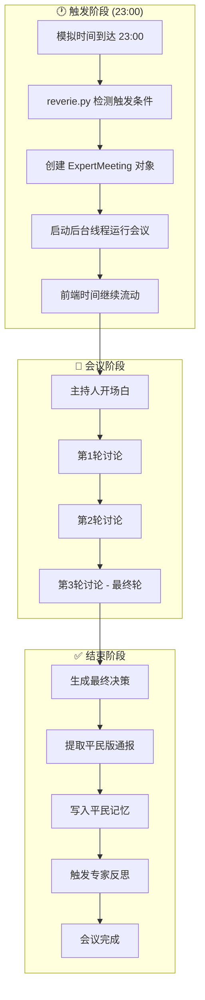
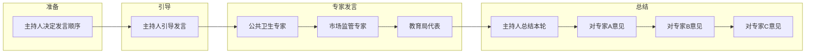
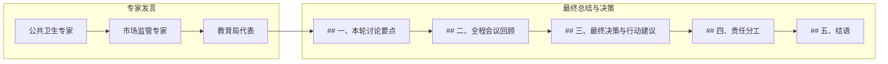
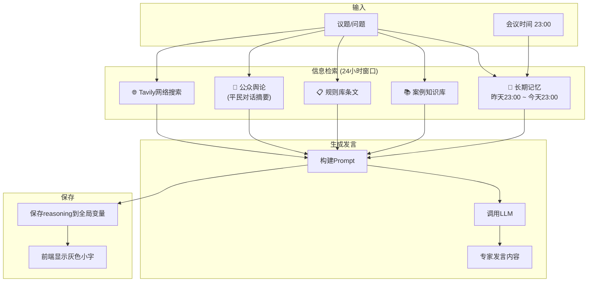
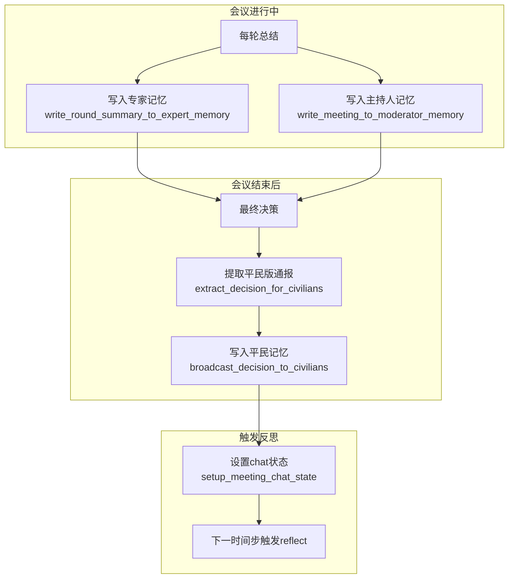
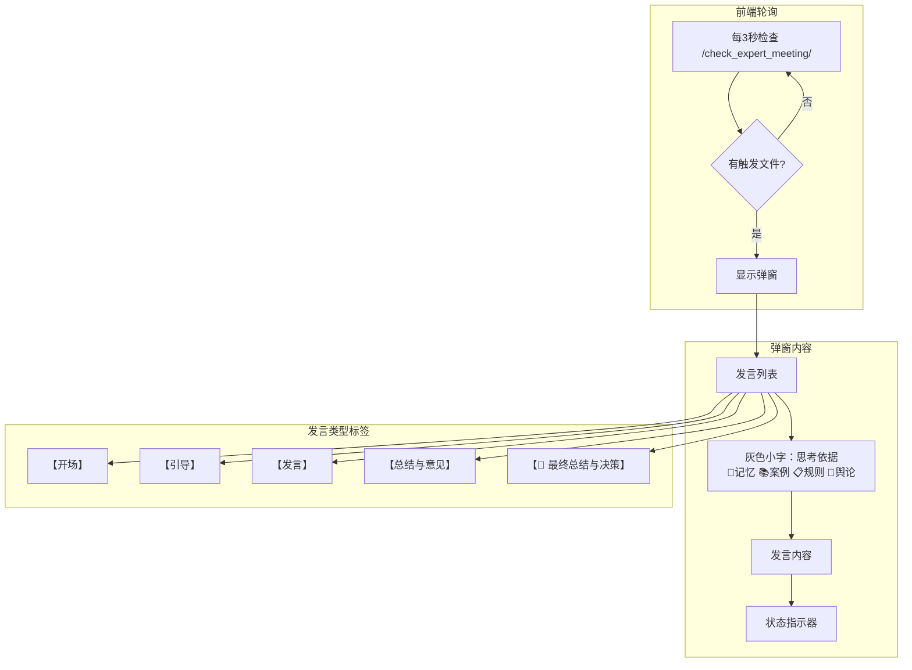

# 专家会议完整逻辑流程图

## 一、总体流程



## 二、单轮讨论流程（第1-2轮）



## 三、最终轮流程（第3轮）



## 四、专家发言信息检索流程



## 五、记忆写入流程



## 六、前端显示逻辑



## 七、关键函数调用链

```
reverie.py
│
├── 23:00 触发
│   └── threading.Thread(target=run_meeting)
│
└── ExpertMeeting(personas, topic, created_time)
    │
    ├── start_meeting()
    │   └── moderator_opening_speech()
    │
    ├── run_full_round_streaming() × 3轮
    │   ├── next_round()
    │   ├── moderator_introduce_expert()
    │   ├── expert_speak()
    │   │   └── get_expert_speech_function()
    │   │       ├── expert_meeting_speech()           # 公共卫生
    │   │       ├── market_supervision_expert_meeting_speech()  # 市场监管
    │   │       └── education_expert_meeting_speech() # 教育局
    │   │
    │   └── end_round(is_final_round)
    │       ├── 第1-2轮: moderator_round_summary()
    │       │           + moderator_give_targeted_advice()
    │       │
    │       └── 第3轮:   moderator_final_summary_and_decision()
    │                   (不再对专家提意见)
    │
    └── finalize_meeting()
        ├── setup_meeting_chat_state()  # 触发反思
        ├── extract_decision_for_civilians()  # 提取平民版
        └── broadcast_decision_to_civilians() # 写入平民记忆
```

## 八、时间线示意

```
Day 1                                    Day 2
──────────────────────────────────────────────────────────────
00:00  ...  10:55      ...      23:00                    23:00
        │              │         │                         │
        │              │         │                         │
        ▼              ▼         ▼                         ▼
   [收集平民对话]  [日常活动]  [专家会议]              [下次会议]
   [写入专家记忆]              │
                               ├── 主持人开场
                               ├── 第1轮讨论 + 总结
                               ├── 第2轮讨论 + 总结
                               ├── 第3轮讨论 + 最终决策
                               ├── 写入平民记忆
                               └── 触发反思
                                        │
                                        ▼
                               [记忆检索范围]
                               昨天23:00 ~ 今天23:00
```

## 九、核心文件清单

| 文件 | 功能 |
|-----|------|
| `expert_init.py` | 专家会议核心逻辑、发言生成、记忆写入 |
| `reverie.py` | 会议触发、后台线程运行 |
| `home.html` | 弹窗UI样式 |
| `main_script.html` | 前端轮询、发言渲染逻辑 |
| `views.py` | API接口 `/check_expert_meeting/` |

## 十、全局变量

| 变量 | 用途 |
|-----|------|
| `_last_expert_reasoning` | 保存最后一次发言的思考依据，供前端显示 |
| `_meeting_thread_running` | 标记会议线程是否在运行 |
| `meeting_triggered` | 标记今天是否已触发会议 |
